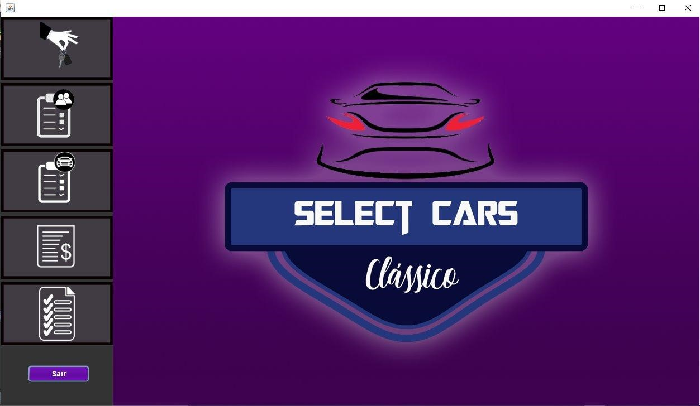

<p align="center">
  <a href="http://ant.design">
    
  </a>
</p>

<h1 align="center"> Java Project, one desktop system and the other a web system!</h1>

## Description 

This project illustrates two system, a to Desktop and orther to Web. The object of project is create a system of classic car rent.

## Demostration of two system



## Starting

To run the project, you will need to install the following programs:

- [NetBeans: You need a IDE to project development](https://netbeans.org/downloads/8.2/rc/)
- [MySQL: Required to create the database](https://www.mysql.com/)
- [XAMPP: You need a serve to run the database](https://www.apachefriends.org/pt_br/index.html)
- [JDK: For project development](https://www.oracle.com/br/java/technologies/javase-downloads.html)

## ⌨️ Development

Use Gitpod, a free online dev environment for GitHub.

[](https://gitpod.io/#https://github.com/Suspir0n/SelectCar.git)
Or use code locally using:
```
cd "Directory of your preference"
git clone https://github.com/Suspir0n/SelectCar.git
```
## Features

The project can be used as a model to start the development of a desktop or web system. It also demonstrates in a practical way how to create a CRUD with MySQL, how to use JSP, JSF, HTML, CSS among others.

## Configuration

Para executar o projeto, é necessário utilizar o NetBeans ou um IDE de sua preferência, de forma que identifique as dependências necessárias para execução no repositório. Uma vez importado o projeto, será possível testar sua funcionalidade em tempo real.

## Contributions

Contributions are always welcome! I hope that it will help someone!
