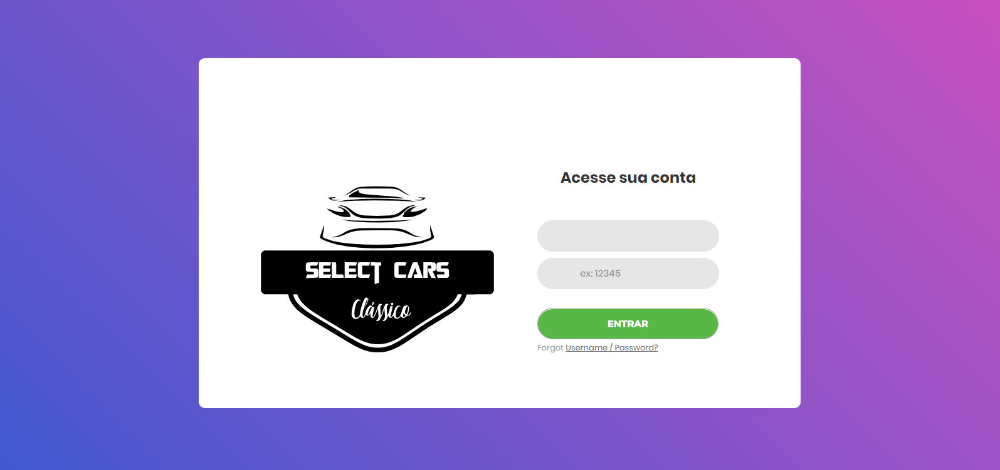
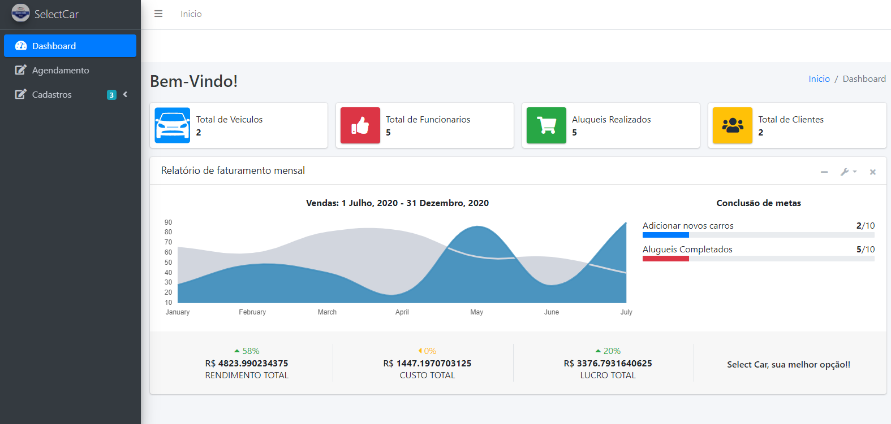
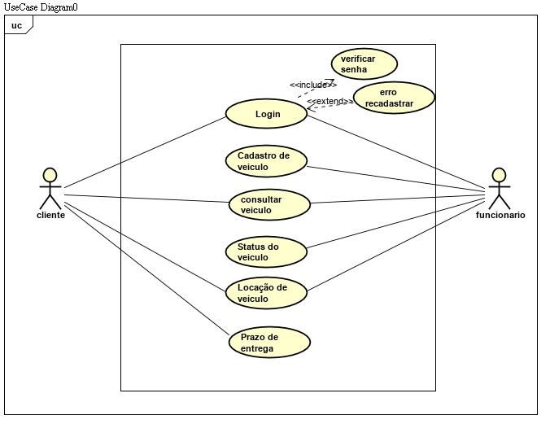

<p align="center">
  <a href="http://ant.design">
    
  </a>
</p>

<h1 align="center"> Java Project, one web system really nice!</h1>

## Description 

This project illustrates one web system. The object of project is create a system of classic car rent.

## Demostration of system



## Introduction

Software nowadays are part of people's routine, and can be found in several qualified hospitals, schools, in places that provide public and private security, among others. However, the production of this material still faces many challenges such as cost reduction, delivery times and quality of the final product. After the pandemic of the corona virus, then the demand for web systems that can handle all the company's routine with safety, quality and speed has become a search where all companies that aim to provide service, sale or rent are in search of these new technologies. Thus, the Select Car system aims to develop a tool that can help and bring ease, interactivity and attractiveness to the public that seeks the offered vehicle rental service.

This document aims to plan, develop and present a system using the resources of Java and Html technologies, servlets, JSP, JSF, together with PrimeFaces. With the objective of proposing a web system aimed at car location companies in which it tends to improve in relation to the customer and company and being implemented will reconcile to the company's administrative and financial module, it can offer monthly invoicing, control of cars that already were delivered or not, customer registration control, among other features. Thus, with the implementation of the system, the company will have greater control along with greater practicality so that customers can request their services and thus increase their generation and prominence in pandemic periods.

## LIST OF FEATURES AND REQUIREMENTS

### Theme: Car Rental
### System Name: Select Car

#### Functionalities

Keep Customer
Keep Employee
Keep Rent
Make Rent Payment
Issue monthly invoicing report

#### Requirements - Maintain Customer

RF001 - Include Customer
RF002 - Consult Customer
RF003 - Change Client
RF004 - Delete Customer |
RF005 - Search Customer |
RN001 - All mandatory Customer fields must be filled
RN002 - It is not allowed to include a customer with the CPF repeated

#### Requirements - Keep Employee

RF006 - Include Employee
RF007 - Consult Employee
RF008 - Change Employee
RF009 - Delete Employee
RF010 - Search Employee
RN003 - All mandatory employee fields must be filled
RN004 - It is not allowed to include Employee with repeated E-mail

#### Requirements - Maintain Rent
RF011 - Include Rental
RF012 - Consult Rent
RF013 - Change Rental
RF014 - Exclude Rent
RF015 - Search Rental
RN005 - All mandatory Rental fields must be filled
RN006 - Negative price is not allowed

#### Requirements - Make Rent Payment
RF014 - Register Payment
RF015 - Cancel Payment
RN008 - All mandatory payment fields must be filled
RN009 - It is not allowed to register Payment with a different amount of debt
Requirements - monthly invoicing report
RN010 - It is not allowed to inform an end date less than the start date in the period of issue of the report

#### Non-Functional Requirements
RNF001 - The Software Development Model adopted by the team was SCRUM
RNF002 - The interface must be intuitive and user friendly

## Use Case diagram



## Starting

To run the project, you will need to install the following programs:

- [NetBeans: You need a IDE to project development](https://netbeans.org/downloads/8.2/rc/)
- [MySQL: Required to create the database](https://www.mysql.com/)
- [XAMPP: You need a serve to run the database](https://www.apachefriends.org/pt_br/index.html)
- [JDK: For project development](https://www.oracle.com/br/java/technologies/javase-downloads.html)

## ⌨️ Development

Use Gitpod, a free online dev environment for GitHub.

[](https://gitpod.io/#https://github.com/Suspir0n/SelectCar.git)
Or use code locally using:
```
cd "Directory of your preference"
git clone https://github.com/Suspir0n/SelectCar.git
```
## Features

The project can be used as a model to start the development of a web system. It also demonstrates in a practical way how to create a CRUD with MySQL, how to use JSP, JSF, PrimeFaces, HTML, CSS among others.

## Configuration

To execute the project, it is necessary to use NetBeans or an IDE of your choice, in order to identify the dependencies necessary for execution in the repository. Once the project is imported, it will be possible to test its functionality in real time.

## Contributions

Contributions are always welcome! I hope that it will help someone!